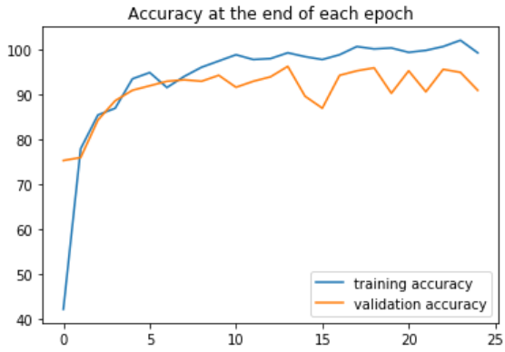
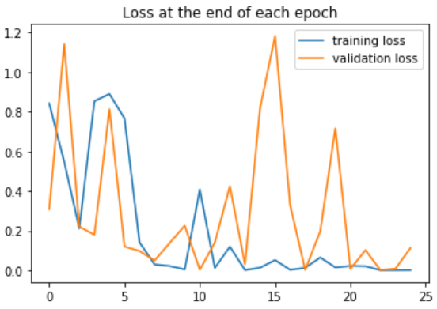

# Pytorch classification

## Overview
This project was created using classification techniques with machine learning in pytorch.  Six classes from an American Sign Language dataset were used to recognize the numbers 0 - 5.  Notice image classification is different from object detection in that the part being classified must be the primary object in the image, which is why we need a region of interest (roi) for classifying from a camera.

## Details
- An example run, after downloading the weights (see below): "python pytorch_classification.py --cam-detect --show-roi"
- "--cam-detect" test the model on your default camera.
- "--data-split" and "--split-root PATH/ROOT PATH/DESTINATION" are used to organize the original ASL dataset, but should not be required since the updated dataset is included in gesture_numbers_ds.
- "--load-weights PATH/WEIGHTS.pt" is used to change the weights file. The default weights used are included as "gesture_numbers_CNNModel_epoch25_personal.pt".
- "--train PATH/DATA" to train your own model, where the DATA directory is structured like gesture_numbers_ds. This means having a train and test directory, with both having a directory for each class.
- "--save-weights PATH/WEIGHTS.pt" is used when training. If "--save-weights" is not defined before running, the weights will be saved to default.pt.
- "--epochs EPOCHS" to change the number of epochs where the default is 25.
- "--test-image PATH/IMAGE" to test on a single image.
- "--contrast CONTRAST" and "--brightness BRIGHTNESS" to change the contrast and brightness of the roi image. Based on lighting and other factors, this may cause better results.  The default values are both 1, meaning no change to original roi.
- "--switch-side" to switch the roi to the other side of the screen.
- "--show-roi" to show the roi.
- The [weights](https://drive.google.com/file/d/1Hqf9vP2ywzi6o3-R_o15koSRBm_kA__p/view?usp=sharing) file can be downloaded there.
- The original ASL [dataset](https://www.kaggle.com/ardamavi/sign-language-digits-dataset) can be found there.

## Results
Below are graphs of the accuracy and loss after each epoch, for the training and validation data.

