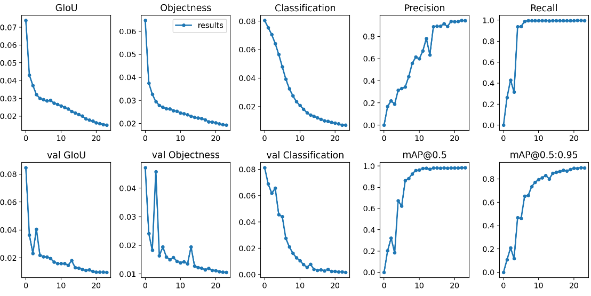

# Sign Language Detection

## Overview
This project uses the latest version of YOLO (You Only Look Once) [YOLOv5](https://github.com/ultralytics/yolov5).  As they state themselves "This repository represents Ultralytics open-source research into future object detection methods, and incorporates our lessons learned and best practices evolved over training thousands of models on custom client datasets..." With this software, I was able to use the EgoHands dataset to create a simple hand detector, then I modified their detect.py script to save images with bounding boxes to different classes.  Since my sign language dataset contains only images of myself, you will probably not see the same results. If you'd like, you can create your own dataset with create_dataset.py and the hand tracking model exp14_hand_best.pt. You could also combine it with my dataset to make a more robust sign language detector.

## Details
- An example run, after downloading the weights (see below): "python create_dataset.py --weights exp16_sl_best.pt  --source 0"
- This project runs best with a graphics card.  My computer has an NVIDIA 1060 6gb.  My laptop with no gpu had trouble running this smoothly.  A lighter, faster model could be trained with yolo5s.yaml, instead of yolo5l.yaml, but with probable loss in accuracy.
- The letters "J" and "Z" were changed since they both require drawing letters in the air instead of making a static gesture.
- To train your own model, run train.py and create your own .yaml file in data.  Also edit the number of classes in the model you're using as instructed in the yolov5 link above.
- create_dataset.py is a modified version of detect.py.  The parts that are modified are separated by lines of hashes.  The arguments shown below are in addition to the ones from detect.py.
- "--create-ds" tells the program to create a dataset.  If this is not called, the program runs the same as detect.py.
- "--gest-class CLASS" declares which class to save to.  The class directory must already be created.  If you are not saving the classes as integers, as in my case, you'll need a dictionary to convert each string to an integer, starting at 0. Default value is "NA".
- "--label-dest" used with --create-ds to define the destination directory for the labels.  Make sure the directory has the class directory defined beforehand.  
- "--img-dest" same as --label-dest but for the images.
- "--bb-img-dest" same as --img-dest, but the images include the bounding boxes.  This is useful for double checking the accuracy of the hand detector.
- "--pic-count COUNT" declares the number of images to save to the class. The default value is 400.
- The yolo5 directory is a copy of the yolov5 link above.  If you'd rather keep yolo up to date, you can fork their repo and simply add create_dataset.py to the main directory.
- The [weights](https://drive.google.com/file/d/18KoHuoSnHEpGNnnYcFLbC6pbZtvELr5X/view?usp=sharing) for the hand detector, download and save it in the main yolo5 directory.
- The [weights](https://drive.google.com/file/d/12gRRFeFacBzISP9PKhzkXlU5kGIbNt5v/view?usp=sharing) for the sign language detector .
- The modified [dataset](https://drive.google.com/file/d/1gpTev25ZnIrOv04ZHm3A-HnomQslxue3/view?usp=sharing) used for building the hand detector.
- The personal [dataset](https://drive.google.com/file/d/11Dr8n-bcBUgAh_C5mNOkMT5nLcKxw4zN/view?usp=sharing) used for sign language detection:
- The original EgoHands [dataset](http://vision.soic.indiana.edu/projects/egohands/).

## Results
Results from training the sign language model provided by YOLOv5

